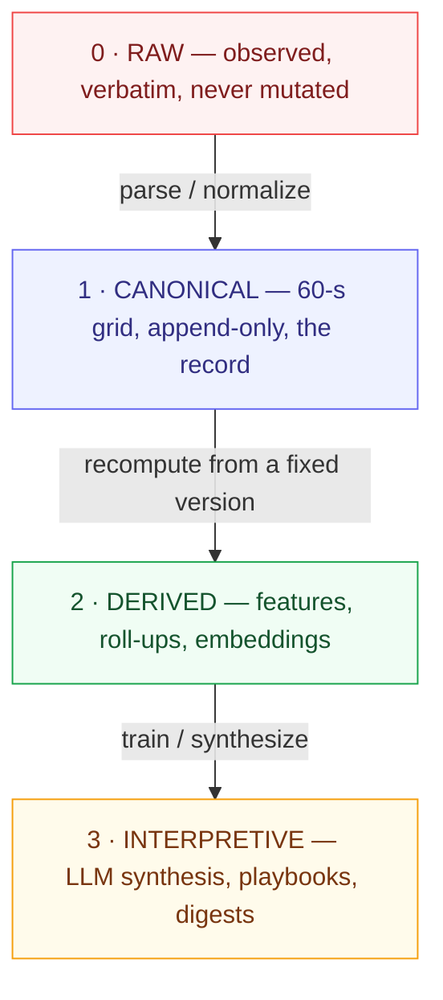
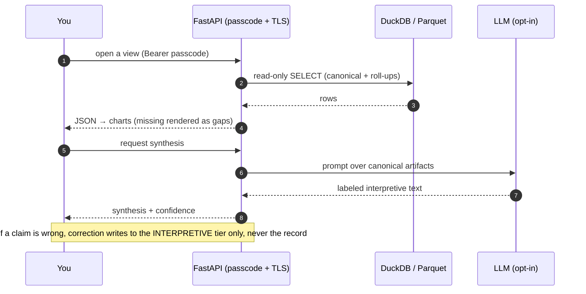

# PMBRS — Personal Behavioral Measurement & Representation System

An end-to-end, **local-first, single-user** platform for turning multimodal
longitudinal self-data (e-ink journaling, wearable biometrics, on-device phone
activity) into **immutable, lineage-tracked behavioral artifacts**; learning
compact **behavioral embeddings** with an autoencoder; and serving the results
through an **authenticated read-only dashboard** with an **opt-in LLM
interpretation layer**.

> **Read this first — what PMBRS is meant to be.**
> PMBRS is a *personal behavioral measurement, experimentation, and
> representation-learning platform* (constitution §1). It exists to support:
>
> - **structured self-experimentation** — "what happens to my state when X?",
>   with declared interventions and comparable windows;
> - **longitudinal pattern discovery** across weeks/months of multimodal data;
> - **reproducible behavioral comparison** between comparable windows of my own life;
> - **evidence-informed personal interpretation** — the LLM layer may *describe*,
>   never diagnose;
> - **behavioral representation-learning research** — the primary scientific
>   artifact is a *well-formed, versioned, judge-able behavioral embedding*,
>   not predictive accuracy.
>
> It is a behavioral **instrumentation** platform and an **experimentation
> infrastructure** system. It is deliberately **not** a clinical system, a
> diagnostic engine, a deterministic psychological inference engine, an
> autonomous optimizer, a productivity scorer, a real-time intervention loop,
> or a multi-user product (constitution: purpose & scope).

---

## How to read PMBRS in one picture

Two diagrams, in roughly one minute. Everything below is the detail behind these.

**The flow — data moves one direction, and trust moves exactly as hard:**

```mermaid
flowchart LR
  D["Devices<br/>Boox e-ink · Galaxy Watch 7<br/>Android collector · browser"]
  N["Normalize & parse<br/>local vision-LLM OCR · HRV · 60-s grid"]
  C[("CANONICAL<br/>immutable JSONL<br/>schema-versioned")]
  F["Deterministic features<br/>stdlib + NumPy, versioned"]
  E["Autoencoder<br/>16 → 12 → 8 → 12 → 16"]
  EMB["8-d behavioral<br/>embedding"]
  ROLL["Parquet + roll-ups<br/>→ DuckDB"]
  API["FastAPI · passcode + TLS<br/>read-only"]
  UI["Dashboards<br/>Streamlit · React + echarts"]
  LLM["Opt-in LLM synthesis<br/>labeled · one-way out"]
  D --> N --> C
  C --> F --> E --> EMB
  EMB --> ROLL
  C --> ROLL
  ROLL --> API --> UI
  API -. "optional" .-> LLM -. "labeled, never written back" .-> UI
  classDef canon fill:#eef2ff,stroke:#6366f1,color:#312e81;
  class C,ROLL canon;
```



**The authority stack — each layer may only *read* from the one below it:**



If you hold just one idea, hold this one: **raw data is never edited after the
fact, derived work is always recomputable, and the only layer that *talks* is
the top one — and it is labeled.** Every other section is a consequence of that.

---

## Practical uses — what you can actually *do* with this

PMBRS is an **instrument**, not an oracle. In concrete terms it lets you:

- **Notice a pattern you'd have missed.** Journal says "couldn't sleep" several
  nights; HRV dips in the same windows; app usage creeps later into the night.
  None of that is a diagnosis — it's a *reproducible signal* worth a
  professional's opinion, **with your own data in front of you**.
- **Compare two days that feel the same but aren't.** The same journal phrase at
  ~14:00; one day the 8-d embedding for that window sits with "focused" entries,
  the other with "restless" ones. The embedding turns a vague feeling into a
  **point you can look at and diff**.
- **See your own baseline, not everyone else's.** The dashboard shows where a
  window lands relative to your last eight weeks — and shows **missing as
  missing, never zeroed**. The reference is *you, on similar days*.
- **Read a week as a story, with the receipts attached.** The opt-in digest
  summarizes what the canonical artifacts say and **links every claim back to
  the windows it drew from** — open the source windows and check.
- **Test an idea against your data before believing it.** "Do I focus better
  with two breaks than one?" — a roll-up compares the two patterns over the
  months you've logged. **The conclusion is yours; the evidence is reproducible.**

Each of these rides on the layer beneath it: no canonical grid → no baseline;
no embeddings → no comparable "feels-the-same" days; no read-only serving → no
dashboard to ask. That bottom-up ordering is the whole reason the system is
built the way it is.

---

## Design pillars

1. **Artifact-oriented** — everything is an immutable record with explicit
   lineage, provenance class, and schema version. Raw data is never mutated;
   derived outputs are regenerated, not edited (deletion/supersession contract).
2. **Canonical 60-second temporal grid** — every modality aligns to one time
   axis. Absence is explicit metadata, **never** an observed zero
   (missingness contract).
3. **Multi-layer authority** — observational > canonical structural > derived >
   interpretive > experimental. No layer silently overwrites a more
   authoritative one.
4. **Batch-analysis first** — designed for reproducible offline analysis, not
   real-time control. Real-time is a downstream application, not infrastructure.
5. **Local-first privacy** — `chmod 700` private root, no telemetry, no network
   at inference, per-modality privacy sign-off before collection.
6. **Scientific humility** — seven *forbidden semantic conflations* are written
   into the glossary (e.g., missing ≠ zero, inference ≠ observation,
   correlation ≠ causation, embedding proximity ≠ similarity of meaning).
7. **Reproducibility by construction** — deterministic cores with injected
   seams (RNG / clock / IO); no wall-clock or network in the deterministic path.
8. **Governance by document** — a constitution, formal contracts, invariants,
   and ADRs rank as authority levels (L0–L3) above any single script.

---

## The pipeline (device → insight)

```
 [Boox e-ink]         [Galaxy Watch 7]           [Kotlin/Compose app]
  rendered pages        Samsung Health CSV         battery, app usage,
  ADB pull / push       inbox-first + ADB          contextual signals
      |                      |                          |
      v                      v                          v
 LLM-vision OCR         HR / SDNN / RMSSD           native collectors
 (local Ollama,        → 60-s canonical grid         → artifacts
  engine slot)              |                          |
      +----------------------+--------------------------+
                             v
              canonical JSON artifacts (store/raw/<source>/)
     immutable · lineage · provenance class · schema versioning
                             v
      Parquet compaction (pyarrow/snappy) + roll-ups → DuckDB
                             v
      representation learning — PyTorch autoencoder 16 → 12 → 8
                               8-d latent = per-window behavioral embedding
                               (NumPy guaranteed-offline fallback)
                             v
      FastAPI read-only JSON API (passcode + TLS) · MLflow (opt-in)
      Streamlit/Altair dashboard + React rewrite (7 views, echarts)
                             v
      notes pipeline (LLM classify / playbooks) + insights synthesis (opt-in)
      → weekly digests, linked idea pages, correction loop
```

**Cadence (ADR-017 D3):** nightly *passover* (ingest → align → compact →
snapshot) · weekly *incremental training* (warm-start) · monthly *full
retrain* + proxy-evaluation quality gate with rollback · early full retrain on
detected feature drift.

---

## The dashboard (reference app)

Where you actually *look at your data*. The Streamlit app is the **reference
analytics dashboard**: read-only, passcode + TLS gated, 8 views. A React/Vite +
echarts rewrite (7 views, auth gate, theming) is progressing in phases — the
Streamlit app stays the reference until it converges.

| View | What it shows |
|---|---|
| **Overview** | The front door — today's roll-up, active sources, what changed since yesterday |
| **Timeline** | Every modality on the 60-s grid, overlaid; missingness shown as honest gaps |
| **Weekly** | Seven-day distributions and roll-ups — your own baseline, not a norm |
| **Modality** | One source at a time (HRV, journal, app-usage) to interrogate a single channel |
| **Insights** | Embedding clusters + opt-in LLM synthesis + correction loop — labeled interpretive |
| **Experiments** | Declared experiments and their declared scope — what's being tested, not asserted |
| **Health** | Collector status, sync latency, battery experiments, artifact integrity |
| **Settings** | Opt-in toggles, source enablement, theme — all read-only over the canonical store |

**A single request, end to end:**



Two guarantees hold for **every** view: the web layer has **no code path that
writes to the canonical store** (enforced by tests), and **every missing sample
is shown as missing** — never filled in as zero.

---

## At a glance

| Concern | What it is |
|---|---|
| **ML** | PyTorch autoencoder (16→12→8→16, tanh) → **8-d behavioral embedding per 60-s window**; train/val split; opt-in **MLflow** tracking; guaranteed-offline **NumPy** fallback |
| **Data / ETL** | ADB/Ollama OCR (Boox), wearable CSV → 60-s grid (Galaxy Watch 7), Android sync (Kotlin) → canonical JSON per file → **Parquet** + roll-ups → **DuckDB** |
| **Feature eng.** | Deterministic stdlib+numpy extraction (sha256-derived payload vectors, shape stats); versioned when logic changes |
| **Serving** | Read-only **FastAPI** behind **passcode + TLS** on a dedicated protected route (ADR-017 D4); **Streamlit + Altair** dashboard and a **React/Vite + echarts** rewrite |
| **Interpretation** | Opt-in **notes** pipeline (classify, playbooks, weekly digests, entry linking) + **insights** synthesis over canonical artifacts only — describe, never diagnose |
| **Collection** | **Kotlin/Compose** Android app (minSdk 24 / target 36, coroutines) + scripted **battery experiments** (run → collect → report) |
| **Governance** | Constitution (8 pillars) · **20 formal contracts** · **308-line system-invariant register** · **5 closed ADRs** + 10 pending · glossary with 7 forbidden conflations |
| **Quality** | **30 pytest files** + 18 Kotlin test classes · GitHub Actions CI (pytest + ruff) · privacy sign-off package |
| **Core stack** | Python 3.11 · PyTorch · scikit-learn · DuckDB · pyarrow · FastAPI · uvicorn · Streamlit · Altair · MLflow · httpx · Ollama · Kotlin/Compose |

---

## Architecture by module

```
src/pmbrs/
├── core/            # canonical Artifact model + StorageAdapter (immutability, lineage, schema versioning)
├── ingestion/
│   ├── boox/        # E-ink → journal: ADB, page resolution, OCR engine slot, manifests,
│   │                # producer CLI, inbox (device-push), journal enrichment         [SHIPPED, Stage 3 cutover open]
│   └── wearable/    # Galaxy Watch 7: parsers (HR/SDNN/RMSSD), 60-s grid, HRV proxy, manifest   [SHIPPED]
├── representation/  # autoencoder model + train / evaluate / runner / checkpoint      [SHIPPED, ADR-011/012 pending]
├── compaction/      # parquet_writer (snappy), rollup, reader, compact()              [SHIPPED]
├── dashboard/       # FastAPI app + api, passcode/session auth, filters, theme
│   └── views/       # overview · timeline · modality · insights · experiments · health · weekly · settings
├── notes/           # notes pipeline: classify · LLM · read-journal · writers · watermark · playbook [SHIPPED]
├── insights/        # opt-in LLM synthesis: collect · window · synthesize · task reader · artifacts  [SHIPPED]
└── auth/            # device bearer-token store for the sync endpoint                 [SHIPPED]

scripts/             # ~25 operational scripts: nightly boox pull, wearable nightly,
                     # host-sync ingest, insights run, daily journal, notes audit/correct,
                     # bromite browser adapter, dashboard server (Streamlit + web)
mobile/app/          # Kotlin/Compose Android collector (unit-tested; battery + app-usage + sync)
web/                 # React/Vite + echarts dashboard rewrite (7 views, auth gate, theming)
docs/                # the governance system: constitution/ · contracts/ · adr/ · invariants/
                     # ingestion/ · boox/ · plans/ · evaluation/ · privacy/ · runbooks/ · …
tests/               # 30 pytest files across every shipped module
```

**Authority model:** observational > canonical > derived > interpretive > experimental.
**Data root:** `~/.pmbrs-private` (dedicated, `chmod 700`; ADR-017 D1).
**Raw layer:** one JSON artifact per file — the simplest, most diffable,
immutable shape (ADR-017 D2). JSONL + SQLite (`events.db`) is the *target* for
the derived/aligned/feature layers once `StorageAdapter` is fully in role.

---

## The governance layer (this is the unusual part)

Most personal projects treat documentation as afterthought. PMBRS inverts that:
the documentation **is** the system's authority hierarchy, and code is only
admitted when it satisfies the documents.

- **Constitution** (`docs/constitution/`) — 8 L0 pillars: purpose & scope,
  temporal model, modality philosophy, authority model, experimentation
  philosophy, interpretability rules, privacy philosophy, artifact philosophy.
- **Glossary** — 15 defined terms plus explicit **forbidden semantic
  conflations**: missing ≠ zero · absence ≠ inaction · inference ≠ observation ·
  correlation ≠ causation · summary ≠ artifact · embedding proximity ≠ meaning
  similarity · replayed data ≠ fresh collection.
- **20 formal contracts** (`docs/contracts/`) — artifact base + identity
  (sha256), lifecycle (immutable finals, state machine, mutation rules),
  deletion & supersession (tombstones), provenance hierarchy (base →
  observational / declarative / pipeline / computational), missingness
  semantics, canonical window, lineage edges (DAG), experiment declaration,
  evaluation artifact, schema evolution, core responsibility.
- **System invariants** (`docs/invariants/system_invariants.md`) — 308 lines of
  machine-checked-style statements, each with rationale, violation
  consequences, and validation method.
- **ADR track** (`docs/adr/`) — 5 closed (010 storage layout · 017 storage
  reality + cadence + dashboard hosting · 019 BoOX OCR architecture · 020 BoOX
  device-push transport · 021 Wearable 60-s grid) and 10 pending
  (identity, orchestration, model selection, training formalization,
  experiment scoping, context-aware comparison, proxy-evaluation metrics,
  encryption at rest, …). Every pending decision blocks exactly the work it
  names — scope discipline by policy.

This exists because the data describes *me*; I would never trust a black box
with my own behavioral record. If a module can't explain *why* a field exists,
it doesn't merge.

---

## Current state of the project (as of 2026-09-21)

### Implemented and exercised

| Subsystem | State | Notes |
|---|---|---|
| **Canonical artifact core** | ✅ Shipped | Artifact model, StorageAdapter, identity + sha256, covered by tests |
| **Boox e-ink → journal** | ✅ Shipped (Stages 1–2) | ADB pull, page resolution, local LLM-vision OCR (Ollama `qwen3.8:27b`, engine-slot), idempotent manifests, producer CLI, nightly entry + seeder, inbox for device-push. **Stage 3** (headless device app, LAN-first push + cloud fallback) is spec'd end-to-end; cutover is the open item |
| **Wearable (Galaxy Watch 7)** | ✅ Shipped | Samsung Health CSV → HR/SDNN/RMSSD parsers → canonical 60-s grid; HRV proxy; manifests; inbox-first transport with ADB fallback (ADR-021 incl. 2026-09-03 amendment); nightly path tested |
| **Android collector** | ✅ Shipped (first slices) | Kotlin/Compose app: battery telemetry, app-usage, sync to `POST /api/v1/artifacts/sync` with bearer tokens; 18 test classes; TLS + auth paths; local-first with tunnel fallback plan |
| **Compaction** | ✅ Shipped | Parquet (pyarrow/snappy) + rollups + DuckDB reader; wearable flat parquet exports |
| **Representation** | ✅ Shipped (stub-level by design) | Autoencoder train/evaluate/runner/checkpoint; offline NumPy path; MLflow opt-in. Formalized model choice + training contract are the pending ADRs |
| **Dashboard** | ✅ Shipped | FastAPI read-only API (passcode + session), 8 Streamlit views, React rewrite (7 views, echarts, auth gate, theming) progressing in phases |
| **Notes + insights** | ✅ Shipped | LLM classification, playbooks, weekly digests, entry linking, correction loop; opt-in synthesis over canonical artifacts only |
| **Browser telemetry (Bromite)** | 🚧 In progress | Contract + 3-phase foundation plan written; first adapter script + tests present; instrumenting browser page telemetry is the next phase |
| **CI** | ✅ Active | pytest + ruff on ubuntu-latest, failure artifact on red |

**Honest scope (stated plainly, on purpose):**

- The training dataset is small; the autoencoder's goal is a **well-formed,
  versioned, judge-able behavioral-embedding artifact**, not predictive
  accuracy.
- The **NumPy backend is a guaranteed-offline** path so the pipeline never
  depends on a torch/CUDA import; **PyTorch is the target backend** when present.
- The dashboard is **read-only**, passcode + TLS gated — there is **no write
  path from the web layer into the canonical store**.
- The LLM layer is **opt-in** and runs only over canonical artifacts; it
  describes, it does not diagnose (interpretability contract).

---

## Where we want to go

### Near-term (next 1–2 quarters)

1. **More ingest — the modality catalog is the roadmap.** Every adapter
   implements the same contract (`fetch / normalize / health_check`,
   observational-only output):

   | Planned adapter | Category | Signal | Status |
   |---|---|---|---|
   | Journal (e-ink) | subjective | writing flow, topics, corrections | ✅ live via Boox |
   | Wearable | observational | HR, HRV, activity, sleep | ✅ live (Galaxy Watch 7) |
   | Mobile activity | observational | app usage, battery, context | ✅ live (first slices) |
   | Browser (Bromite) | observational | domain/topic telemetry | 🚧 Phase 1–2 of 3 |
   | Calendar | declarative | meetings, scheduled context | 📝 spec'd (ADR gated) |
   | Mobile sensors | observational | accelerometer, motion | 📝 plan + backlog written |

2. **Representation formalization** — close ADR-011 (model selection:
   contrastive time-series vs VAE/FactorVAE vs cross-modal CLIP-style, the
   survey is written), ADR-012 (training contract + rollback gate), ADR-015
   (proxy-eval metrics: temporal coherence, reconstruction consistency,
   clustering stability, modality-ablation sensitivity).
3. **Storage completion** — JSONL + SQLite index layer for derived artifacts
   via `StorageAdapter`; ADR-016 encryption at rest; pending-queue and
   checkpoint subroots brought into use.
4. **Experimentation infrastructure** — ADR-013/014 (experiment scoping +
   context-aware comparison semantics) so declared interventions and
   pre/post windows are first-class artifacts.
5. **Dashboard convergence** — finish React rewrite phases (the Streamlit
   app remains the reference), stabilize the protected domain route, and the
   live-update (WebSocket) path.
6. **Boox Stage 3 cutover** — headless device-push app, wake strategy,
   failure modes are all specified; execution is the remaining work.

### Future work (experiments & explorations)

- **👓 Infrared eye-tracking glasses** — gaze/pupil/blink stream as a new
  observational modality. Open research question for this project: can gaze
  dynamics over the same 60-s canonical grid add signal the journal + wearable
  pair doesn't already carry? Treated strictly as an *experiment candidate*,
  gated by a privacy sign-off before any collection (high-risk modality by
  constitution).
- **Additional wearables / biosignals** — sleep-stage detail, EDA/stress
  markers, respiratory rate; each is a new adapter on the same contract, not a
  new architecture.
- **Cross-modal representation** — contrastive / CLIP-style training once two
  or more modalities have stable per-window feature vectors (survey in
  `docs/representation/model-selection.md`).
- **Browser context enrichment** — from raw domain telemetry to a
  task/topic-level layer that aligns with journal entries and wearable
  windows.
- **Battery/energy experiments** — the run → collect → report harness exists;
  formal experiment declarations (ADR-013/014) will make them first-class.
- **Long-horizon validation** — multi-month embedding stability and
   drift-detection studies; the cadence split (nightly/weekly/monthly) is
   built for exactly this.

The rule for everything above: **new modality = new adapter + one privacy
sign-off + one entry in the modality catalog** — never a new pipeline.

---

## Quickstart

```bash
# Data / ML env (see requirements.txt)
python -m pip install -r requirements.txt

# Ingest a Boox e-ink export (ADB pull -> OCR -> canonical artifacts)
python -m pmbrs.ingestion.boox.cli --help

# Train / evaluate the representation model
python -m pmbrs.representation.train --local     # offline, no MLflow
python -m pmbrs.representation.train --mlflow    # opt-in tracking (self-hosted)

# Compaction -> Parquet + rollups
python -m pmbrs.compaction.compact

# Serve the read-only analytics API (passcode + TLS)
uvicorn pmbrs.dashboard.app:app --host 127.0.0.1 --port 9100

# Dashboard (Streamlit reference app)
streamlit run src/pmbrs/dashboard/app.py
```

## Verifying

```bash
python -m pytest tests/ -v --tb=short
```

30 test files cover: artifact shape (Boox), Boox producer/manifest, wearable
parsers/grid/HRV/manifest/e2e-real-export/nightly path, mobile raw ingest,
bromite adapter, Parquet compaction + rollup, representation pipeline,
dashboard auth + smoke, notes + insights + playbook + corrections, storage
adapter, and Phase-0 auth. CI runs the same suite on `ubuntu-latest`
(`workflows/ci-integration.yml`) and uploads a failure artifact on red.

---

## Repository layout (top level)

```
├── src/pmbrs/      # the platform module (see architecture above)
├── scripts/        # operational entry points (nightlies, ingest, dashboards)
├── mobile/         # Kotlin/Compose Android collector + tests
├── web/            # React dashboard rewrite (Vite + echarts)
├── docs/           # constitution · contracts · ADRs · invariants · subsystem specs
├── tests/          # pytest suite (30 files)
├── config/         # external data policy, runtime config (read-only policy enforced)
├── schemas/        # artifact schema definitions
├── templates/      # report templates (e.g., battery experiment reports)
├── artifacts/      # local run artifacts (not user data — user data lives in ~/.pmbrs-private)
├── workflows/      # CI (relocated from .github/workflows — OAuth scope workaround)
└── requirements.txt
```

## Key documents

- [`docs/index.md`](docs/index.md) — the documentation system & navigation
- [`docs/constitution/`](docs/constitution/) — L0 authority pillars
- [`docs/contracts/`](docs/contracts/) — the 20 formal contracts
- [`docs/invariants/system_invariants.md`](docs/invariants/system_invariants.md) — invariant register
- [`docs/adr/`](docs/adr/) — decision records (5 closed, 10 pending, all scoped)
- [`docs/boox/`](docs/boox/) — e-ink pipeline: recon → stage 1 spec → stage 2 → stage 3 plan
- [`docs/plans/`](docs/plans/) — dashboard, notes pipeline, Boox depth & links
- [`docs/privacy/`](docs/privacy/) — mobile privacy sign-off package
- [`docs/evaluation/`](docs/evaluation/) — integrity + representation-quality suites
- [`CONTRIBUTING.md`](CONTRIBUTING.md) — CI status guide & contribution rules
